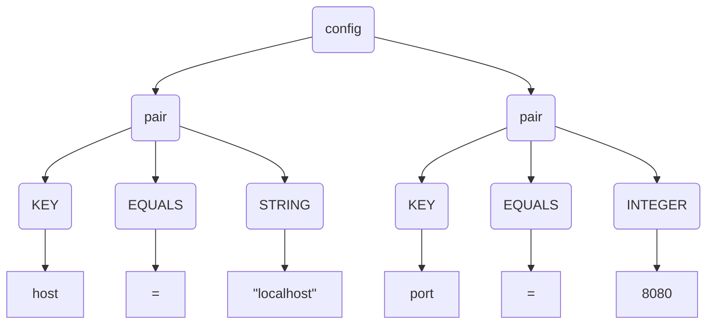

# Getting Started

Antlr is an is a very powerful lexer and parser generator tool. That can generate both in isolation. As such the primary 
focus of airbag is to enable the testing of both components in total isolation.

## Installation
[Instructions on how to add the library as a dependency, e.g., Maven or Gradle snippet]

## Core Concepts: Lexer and Parser

Before diving into an example, let's clarify the roles of the lexer and the parser. When processing text, we use a two-stage process.

### The Lexer: The Tokenizer

The first stage is **lexical analysis**, performed by a **lexer** (or tokenizer). The lexer scans the raw input string and breaks it into a sequence of meaningful chunks called **tokens**. Each token has a type and may contain the original text it represents.

For example, imagine a lexer for a simple configuration file. Given the input string:
`host = "localhost" port = 8080`

The lexer would produce a stream of tokens like this:
`host` | `=` | `"localhost"` | `port` | `=` | `8080`

Each of these tokens is then classified by type:

|      KEY      |    EQUALS     |    STRING     |      KEY      |    EQUALS     |    INTEGER    |
|:-------------:|:-------------:|:-------------:|:-------------:|:-------------:|:-------------:|
|    `host`     |      `=`      | `"localhost"` |    `port`     |      `=`      |    `8080`     |

The output is a flat list of tokens, which is easier to work with than a raw string.

### The Parser: The Structure Builder

The second stage is **syntax analysis**, performed by a **parser**. The parser takes the flat list of tokens from the lexer and builds a hierarchical structure called a **parse tree** (or abstract syntax tree). This tree represents the grammatical relationships between the tokens.

Continuing our configuration example, the parser would take the token stream and, based on a set of grammar rules (e.g., "a configuration is a series of key-value pairs"), it would build a tree like this:



This tree is a much richer representation of the input. It understands that `"localhost"` is the value for the `host` key. Airbag is designed to help you test both of these stages independently to ensure they work exactly as you expect.

## First Example

Let's walk through an example of testing a lexer and a parser for a simple expression grammar.

### The Grammar

First, we need a grammar. We'll use a file named `Expression.g4`:

```g4
grammar Expression;

prog: stat+ EOF;

stat: expr NEWLINE
    | ID '=' expr NEWLINE
    | NEWLINE
    ;

expr: expr ('*'|'/') expr
    | expr ('+'|'-') expr
    | INT
    | ID
    | '(' expr ')'
    ;

ID: [a-zA-Z]+;
INT: '-'?[1-9][0-9]*;
NEWLINE: '\r'?'\n';
WS: [ \t]+ -> skip;
```

This grammar defines simple arithmetic expressions.

### Testing the Lexer

Now, let's write a test for the lexer to ensure it correctly tokenizes an input string. We'll test the input `a = 10 + b`.

```java
import io.github.airbag.Airbag;
import io.github.airbag.symbol.Symbol;
import io.github.airbag.symbol.SymbolProvider;
import org.junit.jupiter.api.Test;
import java.util.List;

class ExpressionLexerTest {
    
    @Test
    void testAssignment() {
        // Get an airbag instance for the lexer from the generated lexer class
        Airbag airbag = Airbag.testLexer("io.github.airbag.gen.ExpressionLexer");
        SymbolProvider provider = airbag.getSymbolProvider();

        // 1. Create an expected list of symbols from a specification
        List<Symbol> expected = provider.fromSpec("""
                (ID 'a')
                ('=' '=')
                (INT '10')
                ('+' '+')
                (ID 'b')
                EOF
                """);

        // 2. Let the lexer tokenize the actual input string
        List<Symbol> actual = provider.fromInput("a = 10 + b");

        // 3. Compare the expected and actual lists of symbols
        airbag.assertSymbolList(expected, actual);
    }
}
```

### Testing the Parser

Next, we'll test the parser to verify that it builds the correct parse tree from a sequence of tokens. For this, we check that the input `10 + 5` is parsed as an addition expression.

```java
import io.github.airbag.Airbag;
import io.github.airbag.gen.ExpressionParser;
import io.github.airbag.symbol.Symbol;
import io.github.airbag.tree.DerivationTree;
import io.github.airbag.tree.TreeProvider;
import org.junit.jupiter.api.Test;
import java.util.List;

class ExpressionParserTest {

    @Test
    void testAdditionExpression() {
        // Get an airbag instance for the parser from the generated parser class
        Airbag airbag = Airbag.testParser(ExpressionParser.class);
        TreeProvider treeProvider = airbag.getTreeProvider();

        // 1. Build the expected tree from a LISP-style specification
        DerivationTree expectedTree = treeProvider.fromSpec("""
            (expr
                (expr (INT '10'))
                '+'
                (expr (INT '5'))
            )""");

        // 2. Create the list of symbols for the parser to consume
        List<Symbol> symbolList = treeProvider.getFormatter()
                                              .getSymbolFormatter()
                                              .parseList("(INT '10') '+' (INT '5')");

        // 3. Parse the symbol list to get the actual tree.
        // The second argument is the start rule.
        DerivationTree actualTree = treeProvider.fromInput(symbolList, "expr");

        // 4. Compare the expected and actual trees
        airbag.assertTree(expectedTree, actualTree);
    }
}
```